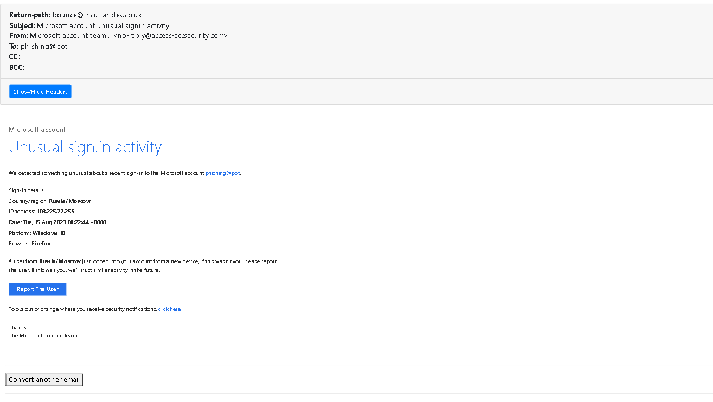
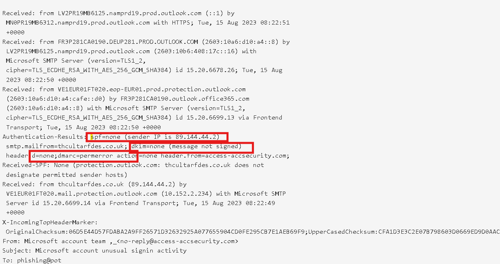

# Task-2-Analyze-a-Phishing-Email-Sample

phishing email sample screenshot



## tools:
mxtoolbox.com:used for email header analysis

chagtgpt,grok ai:used for improving quality of analysis and fast anlaysis

https://msgeml.com/: used for viewing email by .eml extesion file (if we have a raw text so we can first save it with .eml extension and view using email veiwer tools)

# Phishing Email Analysis Report  
**Sample ID:** Microsoft Unusual Sign-in Activity Phishing (August 2023 sample)  
**File format:** Raw .eml (MIME email)  
**Analysis date:** February 2026  
**Objective:** Identify phishing indicators, explain attack techniques, and highlight detection points

## 1. Email Basic Information

| Field                  | Value                                                                 | Comment / Red Flag?                                 |
|------------------------|-----------------------------------------------------------------------|------------------------------------------------------|
| From                   | Microsoft account team <no-reply@access-accsecurity.com>             | **Spoofed** – looks like Microsoft but domain is fake |
| Reply-To               | solutionteamrecognizd03@gmail.com                                     | **Very high risk** – personal Gmail address         |
| Return-Path            | bounce@thcultarfdes.co.uk                                             | **Random unrelated domain** – classic phishing sign  |
| Subject                | Microsoft account unusual signin activity                             | Mimics real Microsoft security alerts                |
| Date                   | Tue, 15 Aug 2023 08:22:49 +0000                                       | —                                                    |
| To                     | phishing@pot                                                          | Likely test/honeypot address                         |
| Message-ID             | <0513db8b-a77e-4240-90dd-7d6cb574e16a@VE1EUR01FT020...>              | Generated by Outlook protection (incoming)           |
| X-Sender-IP            | 89.144.44.2                                                           | Sending server IP                                    |
| Content-Type           | text/html; charset="UTF-8"                                            | HTML phishing email                                  |
| Importance             | high                                                                  | Tries to create urgency                              |

## 2. Authentication & Email Security Headers (Very Important)

| Check          | Result               | Meaning / Why it's suspicious                                                                 |
|----------------|----------------------|------------------------------------------------------------------------------------------------|
| SPF            | spf=none             | Domain **thcultarfdes.co.uk** has **no SPF record** → no permission to send from 89.144.44.2 |
| DKIM           | dkim=none            | No DKIM signature at all → unsigned email                                                      |
| DMARC          | dmarc=permerror      | DMARC policy cannot be evaluated (usually because domain has no valid SPF/DKIM) → **treated as fail** |
| Received-SPF   | None                 | protection.outlook.com says: domain does not designate permitted sender hosts                   |
| Authenticated  | Anonymous            | X-MS-Exchange-CrossTenant-AuthAs: Anonymous                                                    |



**Conclusion:** This email **fails all major email authentication checks** (SPF, DKIM, DMARC).  
Real Microsoft emails always pass SPF + DKIM and usually have a strict DMARC policy (p=reject/quarantine).


## 3. Sending Infrastructure (Origin & Path)

- **Sending IP:** 89.144.44.2  
  → Located in **Russia** (RIPE region, commonly used for phishing/spam campaigns)  
  → Not part of Microsoft infrastructure  
  → Frequently appears in phishing samples and abuse reports

- **Sending domain:** thcultarfdes.co.uk  
  → Random-looking string → **not related to Microsoft in any way**  
  → Likely registered just for this campaign (throwaway domain)

- **IP in body (claimed sign-in IP):** 103.225.77.255  
  → Geolocation: **Russia / Moscow** (according to the email)  
  → Actually registered in **India** (Mumbai) – proxy/VPN or false geolocation used  
  → Also appears in multiple phishing reports and spam databases

**Screenshot recommendation:**  
- Table or screenshot comparing:  
  - Real sending IP: 89.144.44.2 (Russia)  
  - Claimed sign-in IP: 103.225.77.255 (Russia/Moscow in email, actually India)  
  → Caption: "Mismatch between real sender IP and claimed login IP"

## 4. Phishing Content & Social Engineering Analysis

**Main message body (HTML):**

> We detected something unusual about a recent sign-in to the Microsoft account phishing@pot.
> 
> A user from **Russia/Moscow** just logged into your account from a new device...
> 
> **Sign-in details**
> - Country/region: **Russia/Moscow**
> - IP address: **103.225.77.255**
> - Date: Tue, 15 Aug 2023 08:22:44 +0000
> - Platform: Windows 10
> - Browser: Firefox

**Urgency & Fear creation:**
- "Unusual sign-in activity"
- "If this wasn't you, please report the user"
- High importance + high priority headers

**Malicious action button:**

```html
<a href="mailto:solutionteamrecognizd03@gmail.com?...&subject=unusual signin activity&body=Report The User">
    Report The User
</a>
```

**What happens when clicked?**
- Opens new email to **solutionteamrecognizd03@gmail.com**
- Pre-fills subject & body with "Report The User"
- Attacker collects:
  - Victim's real email address
  - Possibly login credentials if they reply with more info
  - Can start follow-up phishing ("please verify your account", "send password", etc.)


## 5. Red Flags Summary Table

| Category                     | Red Flag Count | Examples                                                                 |
|------------------------------|----------------|--------------------------------------------------------------------------|
| Sender spoofing              | ★★★★★          | Fake From domain, unrelated Reply-To Gmail, random Return-Path           |
| Email authentication         | ★★★★★          | SPF=none, DKIM=none, DMARC=permerror                                     |
| Sending IP reputation        | ★★★★☆          | Russian IP not belonging to Microsoft, known in phishing samples         |
| Social engineering           | ★★★★★          | Urgency, fear, fake login details, fake location                        |
| Call to action               | ★★★★★          | "Report The User" → sends sensitive info to attacker                     |
| Branding & design            | ★★★★☆          | Mimics real Microsoft alert but uses free Gmail + no real links         |

**Overall verdict:**  
**100% phishing email** – impersonation of Microsoft security notification  
Goal: Trick user into replying to attacker-controlled Gmail address → credential harvesting, follow-up attacks, or account takeover attempts.


